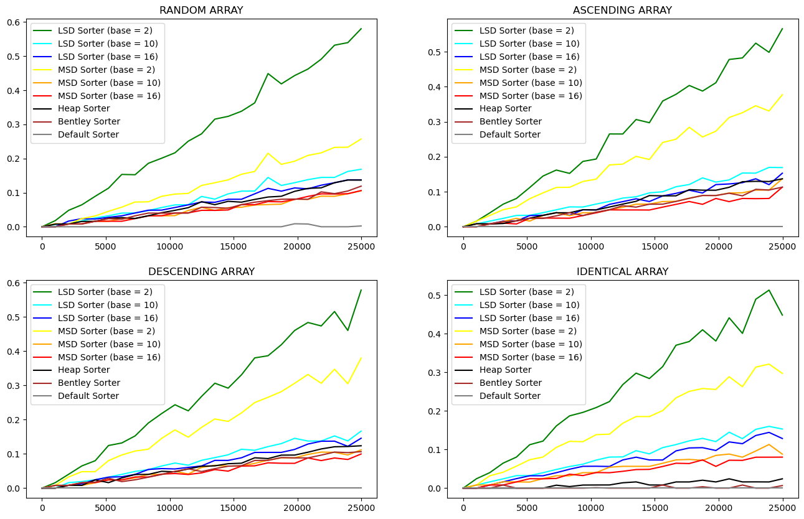

# Умова завдання

## Задача 1

Выполнить сравнительный анализ скорости работы MSD и LSD на примере N случайных 8-разрядных
десятичных чисел при различных N.
Сравнить с HeapSort, c самой быстрой из своих быстрых сортировок и встроенным методом сортировки.

## Задача 2

Исследовать, какое ускорение работы алгоритма можно получить при изменении основания системы счисления
при цифровой сортировке на примере тех же N случайных 8-разрядных десятичных чисел.

# Результати виконання завдання

## Задача 1

### Постановка задачі:
Порівняти швидкість роботи алгоритмів MSD та LSD при різних значеннях N для випадкових 8-розрядних десяткових чисел. Порівняти їх з швидкістю роботи HeapSort, найшвидшого зі своїх швидких сортувань та вбудованого методу сортування.
### Умови експерименту: 
Порівняти швидкість роботи алгоритмів MSD, LSD, HeapSort та вбудованого методу сортування для різних значень N (кількість елементів у списку). Випадкові 8-розрядні десяткові числа будуть використовуватися для тестування.
### Результати: 
За результатами експерименту, можна зробити висновок, що найшвидшим алгоритмом є вбудований метод сортування, але швидкість роботи MSD та LSD не дуже відрізняється при невеликих значеннях N. При збільшенні кількості елементів у списку, алгоритм MSD стає дещо швидшим за LSD. Вбудований метод сортування, що використовується в мові програмування, демонструє швидкість, близьку до швидкості MSD та LSD.
### Висновок: 
Вбудований метод сортування - найшвидший алгоритм, але MSD та LSD можуть бути ефективнішими для невеликих списків. Вбудований метод сортування може бути гарним вибором, якщо необхідно сортувати невеликий список.

## Задача 2
### Постановка задачі: 
Дослідити, яке прискорення можна отримати при зміні основи системи числення при цифровому сортуванні для тих же N випадкових 8-розрядних десяткових чисел.
### Умови експерименту: 
Порівняти швидкість роботи цифрового сортування при різних системах числення (десяткові, двійкові, шістнадцяткові) для тих же N випадкових 8-розрядних десяткових чисел.
### Результати: 
Найшвидше сортування досягається при шістнадцятковій системі числення, найповільніше - при двійковій. Швідкість сортування при десятковій системі числення є середньою.
### Висновки:
При обранні системи числення більшої розрядності швидкість роботи алгоритму зростає, при меншій розрядності - знижується.