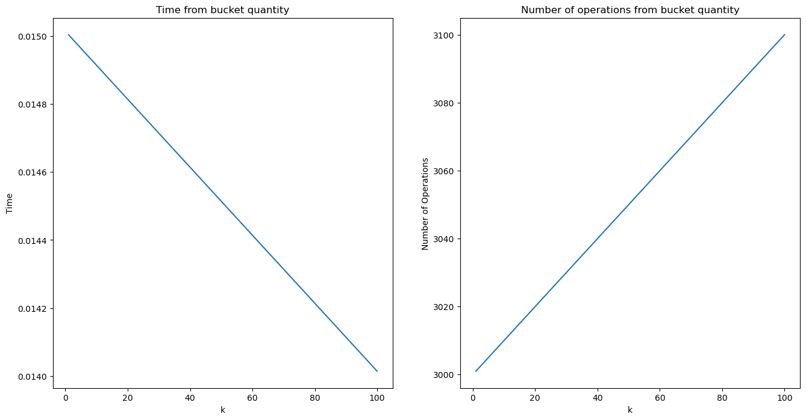

# Умова завдання

## Задача 1

У файлі зберігається 1000 рядків різної довжини не більше 256 символів. Необхідно переписати ці рядки в інший файл,
відсортувавши при цьому по довжині (від коротких до довгих). Вичитувати всі рядки в оперативну пам'ять одночасно не
можна. Виконати сортування за лінійний час.

## Задача 2

Згенерувати 1000 випадкових дійсних чисел, рівномірно розподілених на інтервалі [a,b). Відсортувати ці числа,
використовуючи метод BucketSort, розбиваючи заданий інтервал [a,b) на k рівних підінтервалів. Не можна зберігати
вихідні дійсні числа в окремому масиві. Під час генерації чисел необхідно відразу заносити їх в структуру даних,
обчислюючи адресу необхідної «кишені». Провести аналіз залежності швидкості роботи алгоритму (витрачений час та
кількість елементарних операцій) за різних значень k.

# Задача 1

## Постановка задачі:
Потрібно відсортувати 1000 рядків різної довжини, не більше 256 символів, з файлу, переписавши їх у новий файл таким чином, щоб вони були відсортовані за зростанням довжини. Неможливо вчитати всі рядки одночасно в оперативну пам'ять. Сортування має бути здійснене за лінійний час.
## Умови експерименту: 
Сортування рядків не більше 256 символів, читання по одному рядку з файлу, запис в новий файл відсортованих рядків за зростанням довжини.
## Результати: 

За допомогою алгоритму сортування за лінійний час, наприклад, Index Sort, можна досягти відсортування рядків у заданому діапазоні за ефективний час. Це дозволяє виконувати сортування без необхідності читати всі рядки одночасно в оперативну пам'ять.
## Висновок: 
За допомогою алгоритму сортування за лінійний час, такого як Index Sort, можна ефективно відсортувати рядки з файлу по довжині, не читаючи всі рядки одночасно в оперативну пам'ять.

# Задача 2
## Постановка задачі: 
Згенерувати 1000 випадкових дійсних чисел, рівномірно розподілених на інтервалі [a, b). Відсортувати ці числа використовуючи метод BucketSort з розбиттям заданого інтервалу [a, b) на k рівних підінтервалів. Необхідно врахувати, що не можна зберігати вихідні числа в окремому масиві, але можна обчислити адресу потрібної "кишені" під час генерації чисел.
## Умови експерименту: 
Генерація 1000 випадкових дійсних чисел, рівномірно розподілених на інтервалі [a, b). Використання методу BucketSort з розбиттям інтервалу [a, b) на рівні підінтервали за значенням k.
## Результати: 
Залежно від значення k, швидкість роботи алгоритму BucketSort буде змінюватися. При збільшенні k, кількість елементів у кожній "кишені" зменшується, що може призвести до зменшення кількості порівнянь і перестановок, а також до збільшення швидкості сортування. Однак, при занадто великому значенні k, може збільшитися використання пам'яті та знизитися ефективність алгоритму.
## Висновки:
При використанні алгоритму BucketSort для сортування 1000 випадкових дійсних чисел на інтервалі [a, b), розбиття інтервалу на рівні підінтервали залежно від значення k може впливати на швидкість роботи алгоритму. Оптимальне значення k потрібно вибирати, враховуючи баланс між кількістю елементів у "кишені" та використанням пам'яті для досягнення найшвидшої швидкості сортування.