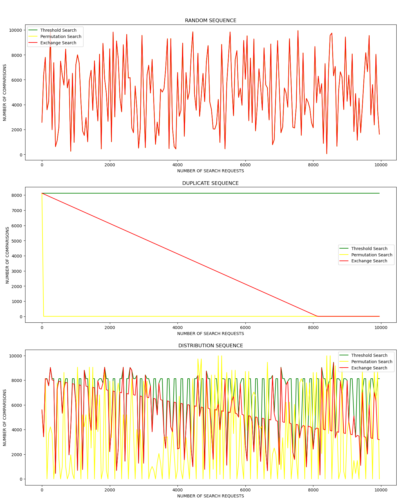
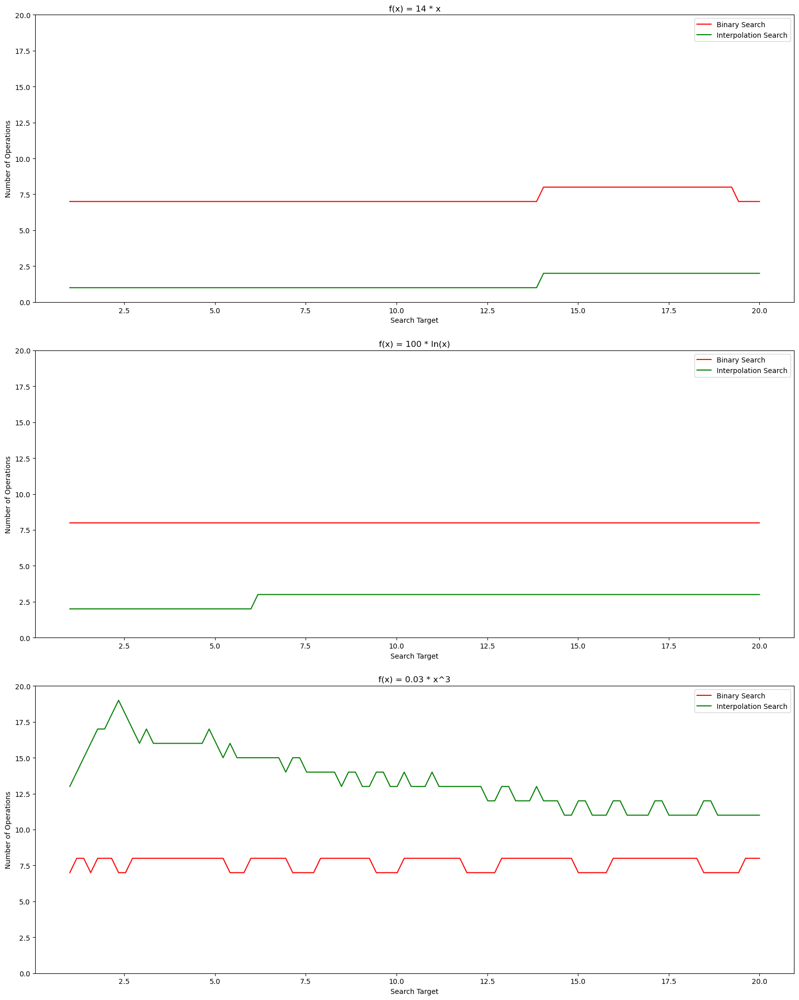

# Умова завдання

## Задача 1

Провести порівняльне дослідження трьох алгоритмів послідовного пошуку: пошук із порогом, пошук із перестановкою знайденого елемента на початок послідовності (зі зсувом масиву) та пошук з обміном знайденого елемента та попереднього. В якості послідовності шуканих елементів при повторному пошуку брати випадкові числа, одне й те число та відомий розподіл (наприклад, 10 випадкових чисел, 10 значень "100", 10 випадкових чисел, 10 значень "100" і так далі).

## Задача 2

Провести порівняльне дослідження алгоритмів бінарного та інтерполяційного пошуку на кожному з трьох масивів, що є табличним. Завданням наступних функцій є визначення значення функції в інтервалі [0,20].

- f(x) = 14 * x
- f(x) = 100 * ln(x)
- f(x) = 0.03 * x^3

# Задача 1

## Постановка задачі:
Необхідно провести порівняльне дослідження трьох алгоритмів послідовного пошуку: пошуку із порогом, пошуку із перестановкою знайденого елемента на початок послідовності (зі зсувом масиву) та пошуку з обміном знайденого елемента та попереднього. При повторному пошуку шукані елементи можуть бути випадковими числами, одним і тим же числом або відповідати відомому розподілу.

## Умови експерименту: 
Розглядаємі алгоритми:
- Пошук із порогом
- Пошук із перестановкою знайденого елемента на початок послідовності
- Пошук з обміном знайденого елемента та попереднього
Типи послідовностей шуканих елементів:
- Випадкові числа
- Одне й те ж число
- Відомий розподіл

Розмір послідовності: n = 10000 (кількість елементів)
## Результати:

На графіку показано кількість операцій для кожного алгоритму та типу послідовності шуканих елементів. З результатів видно, що алгоритм пошуку з обміном знайденого елемента та попереднього має найстабільнішу швидкодію. Алгоритми пошуку із порогом та пошуку із перестановкою знайденого елемента на початок послідовності мають приблизно однакову швидкодію, проте пошук з перестановкою є дещо ефективніший для випадку відомого розподілу.

## Висновок: 
- Алгоритм пошуку з обміном знайденого елемента та попереднього демонструє найкращу стабільність швидкодії для всіх типів послідовностей шуканих елементів.
- Алгоритми пошуку із порогом та пошуку із перестановкою знайденого елемента на початок послідовності мають приблизно однакову швидкодію.
- Алгоритм пошуку із перестановкою знайденого елемента на початок послідовності є дещо ефективнішим для випадку відомого розподілу.

# Задача 2
## Постановка задачі: 
Необхідно провести порівняльне дослідження алгоритмів бінарного та інтерполяційного пошуку на трьох масивах, що є табличними. Завданням наступних функцій є визначення значень функцій у інтервалі [0,20].
- f(x) = 14 * x
- f(x) = 100 * ln(x)
- f(x) = 0.03 * x^3
## Умови експерименту: 
- Побудувати табличний масив для кожної з трьох функцій в інтервалі [0,20].
- Застосувати алгоритм бінарного пошуку та алгоритм інтерполяційного пошуку на кожному з масивів.
- Заміряти кількість операцій при виконанні кожного алгоритму для кожного масиву.
- Побудувати графік виконання алгоритмів для шуканих елементів.

## Результати:

- Для функції f(x) = 14 * x та f(x) = 100 * ln(x) інтерполяційний пошук працює краще (має меншу кількість операцій)

- Для функції f(x) = 0.03 * x^3 бінарний пошук працює краще (має меншу кількість операцій)

- Обидва алгоритму пошуку мають логарифмічну складність

## Висновки:
- Для послідовностей, де розподіл є приблизно пропорційним, інтерполяційний пошук працює краще
- Для інших послідовностей бінарний пошук може працювати краще
- Обидва алгоритми є досить швидкими, адже мають логрифмічну складність
