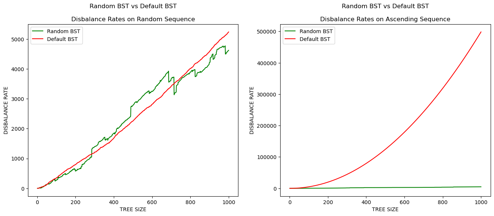
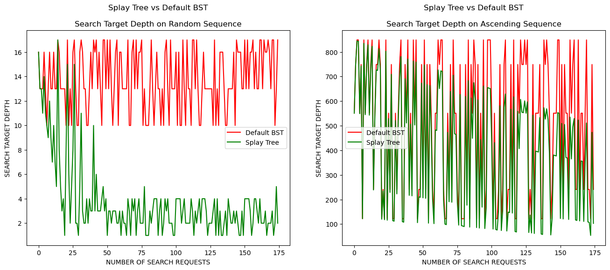

# Умова завдання

## Задача 1

Порівняти характеристики звичайного та рандомизованого BST, які побудовано на випадкових  та упорядкованих даних

## Задача 2

Порівняти характеристики звичайного BST та Splay tree при різних типах вихідних даних (випадкові дані, впорядковані, однакові) і на різних обсягах даних.

## Задача 3

Реалізувати AVL-дерево. 
Перевірити, чи висота AVL-дерева відповідає теоретичним межам при різних типах вихідних даних (випадкові дані, впорядковані, однакові) і на різних обсягах даних.

# Задача 1

## Постановка задачі:
Порівняти характеристики звичайного (незбалансованого) та рандомізованого (збалансованого) BST на випадкових та упорядкованих даних.
## Умови експерименту: 
1. Згенерувати випадкову послідовність цілих чисел та послідовність упорядкованих цілих чисел.
2. Побудувати звичайне BST на основі цих послідовностей.
3. Побудувати рандомізоване BST на основі цих послідовностей.
4. Заміряти міру дизбалансу (сумі модулів різниці кількості потомків лівого і правого піддерева для кожої з вершин дерева) для звичайного та рандомізованого BST.
5. Порівняти отримані результати.
## Результати:

- На випадкових даних дерева збалансовані приблизно однаково
- На впорядкованих даних рандомизоване дерево має набагато вищу продуктівність, адже звичайне дерево фактично стає цепочкою
## Висновок: 
1. Рандомізований BST, завдяки випадковому розташуванню елементів, забезпечує більш рівномірну балансованість дерева, що покращує продуктивність, та нівелює вплив таких окремих випадків розподілу вхідних даних, як впорядковані послідовності, на яких звичайний BST має дуже низку продуктивність.
2. На відміну від звичайного BST, результати роботи рандомізованого BST на однакових послідовностях є нестабільними, адже при однакових наборах даних може випадково мати різну структуру, що призводить до різної ефективності роботи.

# Задача 2
## Постановка задачі:
Порівняти характеристики звичайного BST та Splay tree на різних типах вихідних даних (випадкові, впорядковані) і на різних обсягах даних.
## Умови експерименту: 
1. Згенерувати випадкову послідовність цілих чисел та упорядковану послідовність цілих чисел.
2. Побудувати звичайне BST та Splay tree на основі цих послідовностей.
3. Заміряти глибину пошуку елементів у кожному з дерев.
4. Порівняти глибини пошуку для звичайного BST та Splay tree на кожному типі даних та різних обсягах даних.

## Результати: 

- При повторних запитах Splay Tree глибина пошуку стає поступово все меншою і меншою
- Робота звичайного BST не залежить від повторюванності пошукових запитів
- Незважаючи на те, що і на впорядкованій послідовності Splay Tree поступово адаптується до пошукових запитів, збалансованість обох дерев є низькою

## Висновки:
1. Splay Tree поступово адапується до повторюваних пошукових запитів, на відміну від звичайного BST
2. Splay Tree доцільніше використовувати для пріоритизації повторюваних пошукових запитів
3. Splay Tree не може гарантувати забалансованість, тому незважаючи на адаптивність, його продуктивінсть може бути незадовільною на впорядкованих послідовностях

# Задача 3
## Постановка задачі:
Реалізувати AVL-дерево та перевірити, чи висота AVL-дерева відповідає теоретичним межам при різних типах вихідних даних (випадкові дані, впорядковані, однакові) і на різних обсягах даних.
## Умови експерименту: 
1. Згенерувати випадкову послідовність цілих чисел, упорядковану послідовність цілих чисел та послідовність з однакових чисел.
2. Побудувати AVL-дерева на основі цих послідовностей.
3. Заміряти глибину усіх листов даних AVL-дерева.
4. Переконатися що різниця глибин будь-якої пари з цих листів не більша за модулем за одиницю.
## Результати: 
    AVL Tree on Random Sequence: { 1 <- 2 <- 3 -> 4 <- 5 -> 6 <- 7 -> 8 <- 9 <- 10 -> 11 <- 12 -> 13 <- 14 -> 15 <- 16 -> 17 <- 18 -> 19 <- 20 -> 21 -> 22 <- 23 -> 24 }
    List of Leaves Heights on Random Sequence [5, 4, 4, 5, 4, 5, 5, 5, 5, 6, 5]
    Random sequence test passed: abs difference between any two AVL Tree leaves depth is not greater then 1

    AVL Tree on Ascending Sequence: { 1 <- 2 -> 3 <- 4 -> 5 <- 6 -> 7 <- 8 -> 9 <- 10 -> 11 <- 12 -> 13 <- 14 -> 15 <- 16 -> 17 <- 18 -> 19 <- 20 -> 21 <- 22 -> 23 -> 24 }
    List of Leaves Heights on Ascending Sequence: [5, 5, 5, 5, 5, 5, 5, 5, 4, 4, 4, 5]
    Ascending sequence test passed: abs difference between any two AVL Tree leaves depth is not greater then 1
- Різниця глибин будь-якої пари з листів AVL-дерева, побудованого на випадковій послідовності, не більша за модулем за одиницю

- Різниця глибин будь-якої пари з листів AVL-дерева, побудованого на впорядкованій послідовності, не більша за модулем за одиницю

## Висновки:
1. Виходячи з того, що різниця глибин будь-якої пари з листів AVL-дерева, побудованого на випадковій послідовності, не більша за модулем за одиницю, можна стверджувати, що висота отриманого дерева <= log(N), де N - кількість елементів дерева. Таким чином, висота отриманого дерева відповідає теоретичним межам.

2. Виходячи з того, що різниця глибин будь-якої пари з листів AVL-дерева, побудованого на впорядкованій послідовності, не більша за модулем за одиницю, можна стверджувати, що висота отриманого дерева <= log(N), де N - кількість елементів дерева. Таким чином, висота отриманого дерева відповідає теоретичним межам.
